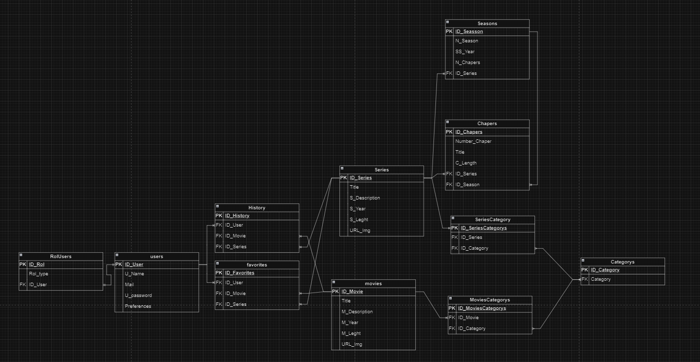
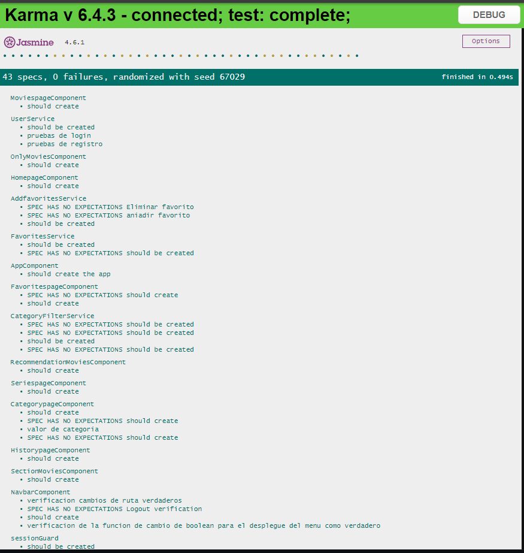
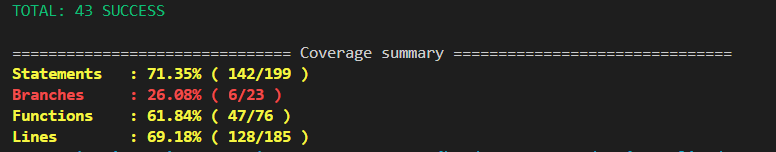
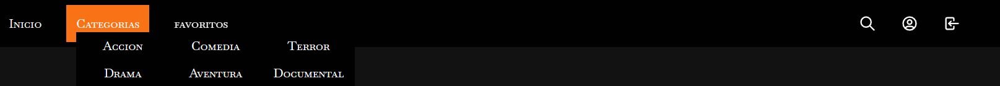
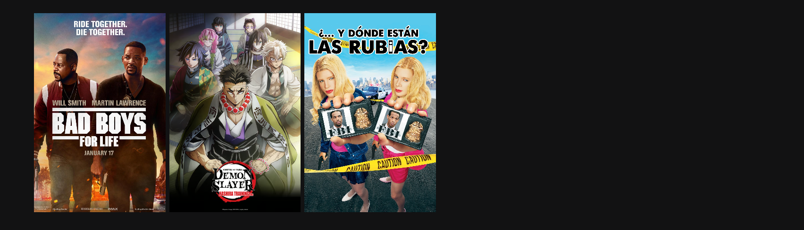
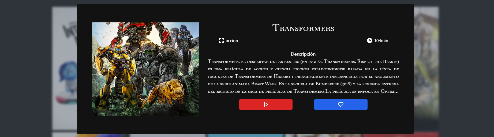
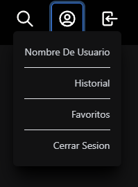

# Author

 [Karla Jimenez ](https://github.com/Karit08)

# Hub Entretenimiento Sprint 6

El Sprint muestra una plataforma de entretenimiento que ofrece un extenso catálogo de películas de diversos géneros, el usuario podra navegar entre diversas peliculas, elegir entre sus peliculas favoritas y ver su historial, además podrá ver los detalles de la pelicula. El proyecto requirio el manejo de tecnologias como MySQL, ademas se ocuparon herramientas como Docker y Kubernetes, para el Back se realizo un servidor local y SQL para conectar la base de datos a la API creada con .NET, programada en lenguaje C#, usando el MVC para manejar la información de las peticiones del sitio. Y finalmente para el Front se ocupo el Framework Angular.

# Requerimientos técnicos
--> Visual Studio Code

--> Node v20.13.1

--> npm v10.5.2

--> Angular CLI 18.1.0

--> TypeScript v5.5.2

--> SQL Server Management Studio 20

--> .NET 8.0.9

--> Docker 8.0

--> Kubernetes 1.33.1

# Descripción de la Elaboración
- El proyecto comenzó definiendolas características esenciales del Hub de Películas.
- Se diseñó una base de datos en SQL Server que incluyó stored procedures para optimizar el rendimiento y asegurar la integridad de los datos. También se implementó una función de hashing para las contraseñas de los usuarios, garantizando así la seguridad de la información almacenada. La base de datos fue normalizada para evitar redundancias y asegurar la consistencia de los datos.
- Se desarrolló el backend utilizando C# con .NET Core. Se añadieron las credenciales, módulos y controladores necesarios. 
- Sse realizaron pruebas en Swagger, las cuales confirmaron que todo operaba de manera satisfactoria.
- Para el frontend utilizo Angular, mejorando los componentes. 
- Se estableció la conexión con la API.
- Se implementaron funciones en el módulo de inicio de sesión y registro para garantizar la seguridad de los datos ingresados. 
- Se implementaron todos los requisitos necesarios para construir las imágenes con Docker.

# Visualización del proyecto









# Instrucciones para su instalacion
* Clonar el proyecto.
* Instala las dependencias: Ejecuta el comando npm install para instalar las dependencias del proyecto.\
* Instalación de MySQL Serve 2022 y SSMS 2022
* Importar BD anexa(STFireDBComplete).
* Descargar archivos adjuntos de la imagen, BD y API anexa en el proyecto.
* Instalacion de API,con creacion de proyecto VS Code.
* Correr API en terminal del protecto."do net run

¡Listo! El proyecto está disponible.

## Backend  Rutas

Users
Login de usuarios

```bash
POST/ api/RegisterUser <--- register
```
```bash
GET/ api/RegisterUser  <--- login
```

Favorites
Permite agregar, eliminar y mostrar las peliculas o series favoritas del usuario.

```bash
GET/ api/Favorites
```
```bash
POST/ api/Favorites/add
```
```bash
POST/ api/Favorites/delete
```

Media
Se muestran todas las peliculas 

```bash
GET/ api/media/Movies
```
```bash
GET/ api/media/Series
```

Category

Se muestran series o peliculas, se pueden usar filtros para buscar por categorias.

```bash
GET/ api/Category/Movies
```
```bash
GET/ api/Category/Series
```

# Retrospectiva

| Aspecto                    | Detalles                                                                                                                                                                                                                                                                                                               |
|--------------------------------|-----------------------------------------------------------------------------------------------------------------------------------------------------------------------------------------------------------------------------------------------------------------------------------------------------------------------------|
| ¿Qué salió bien?           | * Aprender los conceptos y herramientas a ocupar <br> * Senti que mi conocimiento se amplio permitiendome desarrollar el proyecto <br> |
| ¿Qué puedo hacer diferente? | * Dedicarle para practicar y hacer pruebas, pues mi equipo de computo no me ayudo <br>  *|
| ¿Qué no salió bien?        | *Mi computadora sigue fallando, asi que tuve solo esta semana para terminar el sprint, pero siento que puede haber mejorado varios aspectos, me siento un poco desepcionada por los resultados. Además no pude terminar satisfactoriamente el proyecto y realizar más priebas antes de entregar el proyecto| 
